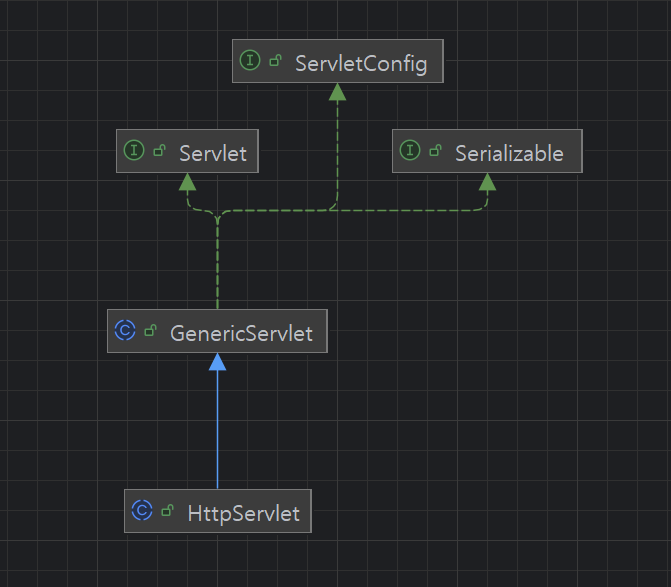

### 5. 서블릿 이해하기


#### javadoc 
```aiignore
https://jakarta.ee/specifications/platform/8/apidocs/
https://jakarta.ee/specifications/platform/8/apidocs/javax/servlet/package-summary
```

#### javax.servlet.http.HttpServlet

```aiignore
```


#### 5.2 서블릿 매핑
```aiignore
web.xml 에 servlet 과 servlet-mapping 정의 필요하다.

<selvlet>
    <servlet-name> ... </servlet-name>
    <servlet-class> ... </servlet-class>
</servlet>

<selvlet-mapping>
    <servlet-name> ... </servlet-name>
    <url-pattern> ... </url-pattern>
</selvlet-mapping>
```

### 6. 서블릿 기초
#### @WebServlet
```aiignore
Servlet 3.0 Java EE 6 부터 @WebServlet 도입 으로 web.xml 작성이 불필요하다.
```

#### setCharacterEncoding
```aiignore

HTTP Request 보낼때 "ContentType" 헤더값이 있고 여기에 charset=.... 이 들어간다.
charset 값으로 CharacterEncoding 되어 들어오지만,
만약 서버상 정책으로 UTF-8 로 하고 싶을 경우 

request.setCharacterEncoding("UTF-8");

로 지정 할 수 있다.

https://jakarta.ee/specifications/platform/8/apidocs/javax/servlet/servletrequest#setCharacterEncoding-java.lang.String-

request.setCharacterEncoding 의 파라미터 타입은 String 이다.


https://docs.oracle.com/en/java/javase/21/docs/api/java.base/java/nio/charset/Charset.html?utm_source=chatgpt.com

Java(JDK) 에서 지원하는 Standard charsets 으로 UTF-8 이 있다.
대소문자 구분은 안한다고 하나,
안전하게 하려면 StandardCharsets.UTF_8.name() 해서 구하는 것이 안전하다.

request.setCharacterEncoding(StandardCharsets.UTF_8.name())
```


#### 6.4 서블릿의 응답처리방법
##### MIME-TYPE
```aiignore
서버에서 웹브라우져로 전송시 어떤 종류의 데이터를 전송하는지 웹 브라우져에게 알려줘야 한다.

1. 정적파일을 요청한 경우
tomcat 에서 정적 파일을 바로 서빙할 수 있는 것은,
tomcat 에서 정적파일 처리등 기본 처리를 위한 DefaultServlet 을 내장하고 있고,
이때 사용자가 요청한 확장자를 보고서, 정적파일 확장자 json 파일을 요청하면
아래 매핑된 mime-type 으로 응답한다. 

    <mime-mapping>
        <extension>json</extension>
        <mime-type>application/json</mime-type>
    </mime-mapping>
    
 
 
2. 별도 서블릿을 만든 경우
이 경우에는 web.xml 의 mime-mapping 을 사용하지 않고
response.setContentType("application/json");
지정한 것으로 응답한다. 
```

##### HttpServletResponse.getWriter()
```aiignore
https://jakarta.ee/specifications/platform/8/apidocs/javax/servlet/http/httpservletresponse

PrintWriter getWriter() throws IOException
서블릿 컨테이너에서 버퍼링을 하므로, PrintWriter 를 바로 사용한다.
BufferedWriter 를 붙일 수는 있으나, 불필요하다.               
```